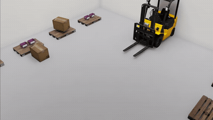

# Isaac Sim Demos

Two minimal NVIDIA Isaac Sim scenes, rendered headless on a RunPod GPU instance:

1. **[City drive-by](#1-city-demo)** — a car parked on a street in the Rivermark city environment, 360° orbit camera
2. **[Warehouse forklift](#2-warehouse-forklift-demo)** — a forklift moves a box between aisles in a 10×10×10 m warehouse, fully scripted kinematic animation

## 1. City demo

An NVIDIA Leatherback car parked on a street in the **Rivermark** outdoor city environment, captured by a camera doing a slow 360° orbit, rendered headless and encoded to video.


*Full-quality video: [simple_city_car.mp4](simple_city_car.mp4)*

## What it does

[`simple_city_car.py`](simple_city_car.py):

1. Starts Isaac Sim headless (`SimulationApp({"headless": True})`)
2. Loads the Rivermark city environment (`Isaac/Environments/Outdoor/Rivermark/rivermark.usd`)
3. Spawns an NVIDIA Leatherback car (`Isaac/Robots/NVIDIA/Leatherback/leatherback.usd`) on a road surface located by probing the bounding boxes of the map's roadmark tiles
4. Adds a distant "sun" light and dome light so the shot is well exposed
5. Orbits a 1280×720 RGB camera 360° around the car over 200 frames (10 s @ 20 fps), saving each frame as a JPEG
6. Frames are encoded to MP4 with ffmpeg

## Running it

Tested with **Isaac Sim 5.1.0** (pip install) on Ubuntu 22.04 with an RTX 4000 Ada (RunPod), Python 3.11.

```bash
sudo apt-get install -y xvfb ffmpeg libglu1-mesa libegl1
export OMNI_KIT_ACCEPT_EULA=yes
xvfb-run -a -s "-screen 0 1280x720x24" python -u simple_city_car.py
ffmpeg -framerate 20 -i simple_city_frames/frame_%04d.jpg -c:v libx264 -pix_fmt yuv420p simple_city_car.mp4
```

> Note: `libglu1-mesa` is required — without it the RTX material system (MDL) fails to load and the camera silently returns empty frames.

## 2. Warehouse forklift demo



*Full-quality video: [warehouse_forklift.mp4](warehouse/warehouse_forklift.mp4)*

A 10×10×10 m warehouse room built from scaled cuboid prims, two aisles of pallets loaded with KLT bins and cardboard boxes, and a forklift that picks up a box in aisle A, carries it across, and sets it down in aisle B.

[`warehouse/warehouse_forklift.py`](warehouse/warehouse_forklift.py) is written as a learning document. The key ideas:

- **Kinematic choreography, no physics.** The whole animation is one waypoint table `(time, x, y, yaw, fork_height)` interpolated per frame with smoothstep easing, and the render loop only calls `world.render()`. Deterministic, stable, nothing to tune.
- **Pose-follow "attach".** While the carry flag is on, the box's pose is set each frame to a fixed offset along the forklift's fork axis — simpler and more robust than USD reparenting mid-sim.
- **Verify assets before trusting them.** The script prints every loaded asset's bounding box (catches missing assets and cm-vs-m unit mismatches) and was developed with a `SMOKE=1` mode that renders stills at key waypoints before committing to a full render. That workflow caught a narrow default camera FOV, a wrong fork-prim match, and the forklift's forks pointing along its local −y axis.

```bash
export OMNI_KIT_ACCEPT_EULA=yes
SMOKE=1 xvfb-run -a python -u warehouse/warehouse_forklift.py   # test stills first
xvfb-run -a python -u warehouse/warehouse_forklift.py           # full 480-frame render
ffmpeg -framerate 20 -i warehouse_frames/frame_%04d.jpg -c:v libx264 -pix_fmt yuv420p warehouse_forklift.mp4
```
